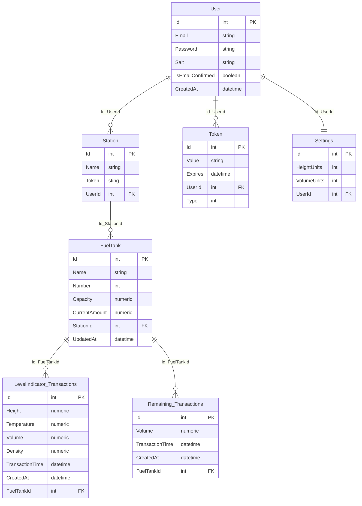

# Fung
Fung is a fuel accounting system. Its goal is to accumulate information from fuel stations in one place, instead of an impressive number of report files, which makes it faster and easier to get the information you need. The data are statistics of fuel residues and indicators of level gauges in real-time.

The system consists of three parts:
- Server (for storing information)
- Front (to access information)
- WPF Application (for transmitting data from the station)

## Applications

- [Backend](./backend) — [.NET 6](https://www.c-sharpcorner.com/article/what-is-new-in-net-6-0/), [PostgreSQL](https://www.postgresql.org).

- [Frontend](./frontend) — [Angular 14](https://angular.io/).

### DB Schema
[dbdiagram.io](https://dbdiagram.io/d/62fe6a1cc2d9cf52fad335c9)

