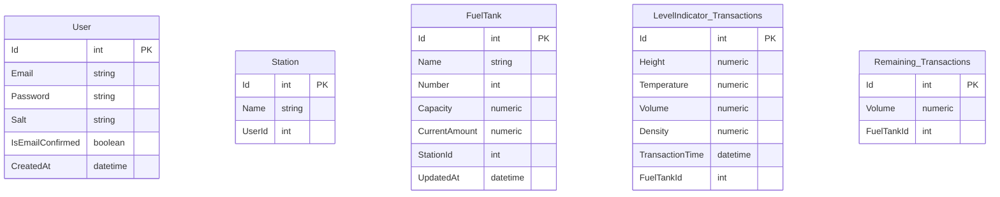

# Fung

### DB Schema

```mermaid
erDiagram
  User {
  Id int PK
  Email string
  Password string
  Salt string
  IsEmailConfirmed boolean
  CreatedAt datetime
}

Station {
  Id int PK
  Name string
  UserId int 
}

FuelTank {
  Id int PK
  Name string
  Number int
  Capacity numeric
  CurrentAmount numeric
  StationId int
  UpdatedAt datetime
}

LevelIndicator_Transactions {
  Id int PK
  Height numeric
  Temperature numeric
  Volume numeric
  Density numeric
  TransactionTime datetime
  FuelTankId int
}

Remaining_Transactions {
  Id int PK
  Volume numeric
  FuelTankId int
}
```