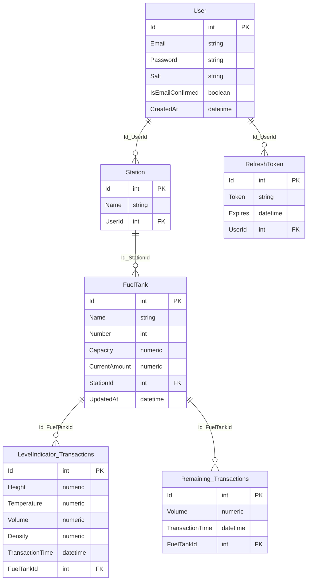

# Fung
Fung is a Fuel accounting system. It`s purpose to accumulate information in one place.

## Applications

- [Backend](./backend) — [.NET 6](https://www.c-sharpcorner.com/article/what-is-new-in-net-6-0/), [PostgreSQL](https://www.postgresql.org).

- [Frontend](./frontend) — [Angular 14](https://angular.io/).

### DB Schema

